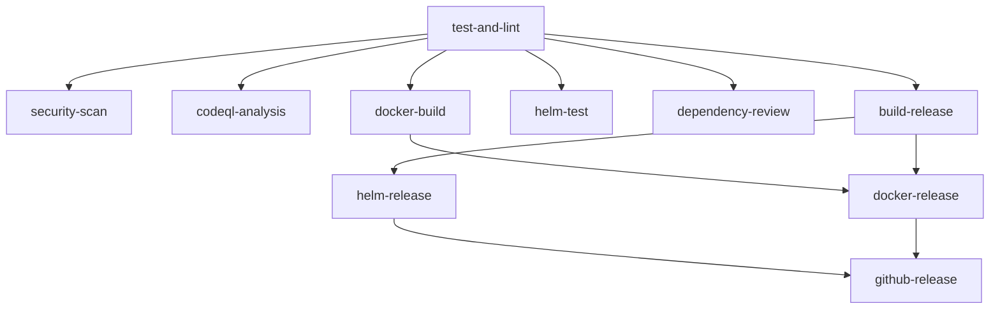

# GitHub Actions Workflows

## Konsolidierte CI/CD Pipeline

Das Projekt nutzt einen einzigen, hocheffizienten Workflow (`main.yml`) für alle CI/CD-Operationen.

### 🚀 **Workflow-Architektur**



### **Job-Übersicht**

| Job | Trigger | Zweck | Dependencies |
|-----|---------|-------|--------------|
| `test-and-lint` | Alle Events | Go Tests, Linting, Format-Check | - |
| `security-scan` | Nach Tests | Sicherheitsscans (Matrix) | test-and-lint |
| `codeql-analysis` | Push/PR | GitHub CodeQL | test-and-lint |
| `dependency-review` | PR only | Dependency Vulnerabilities | - |
| `docker-build` | Nach Tests | Container Build & Test | test-and-lint |
| `helm-test` | Helm Changes | Chart Testing mit K8s | test-and-lint |
| `build-release` | Tags only | Multi-Platform Binaries | test-and-lint, docker-build |
| `docker-release` | Tags only | Container Registry Push | build-release |
| `helm-release` | Tags only | OCI Chart Push | build-release |
| `github-release` | Tags only | GitHub Release Creation | All release jobs |

### **Optimierungen**

#### **1. Matrix Strategy für Security Scans**

```yaml
strategy:
  matrix:
    scanner: [gosec, nancy, trivy-fs]
```

Alle Sicherheitstools laufen parallel statt sequenziell.

#### **2. Bedingte Ausführung**

- **Helm Tests**: Nur bei Chart-Änderungen
- **Dependency Review**: Nur bei Pull Requests
- **Release Jobs**: Nur bei Version Tags

#### **3. Artifact Sharing**

- Docker Images zwischen Build/Release Jobs
- Go Module Cache workflow-weit
- Release Binaries für GitHub Release

#### **4. Intelligente Trigger**

```yaml
needs: test-and-lint
if: always() && (needs.test-and-lint.result == 'success')
```

### **Trigger-Bedingungen**

| Event | Jobs ausgeführt |
|-------|----------------|
| `push` zu `main/develop` | Test, Security, Docker Build |
| `pull_request` | Test, Security, Dependency Review |
| `push` Tag `v*` | Alle Jobs + Release Pipeline |
| `workflow_dispatch` | Manuelle Ausführung |

### **Performance-Vorteile**

- **🔄 Parallelisierung**: Security Scans laufen parallel
- **📦 Caching**: Go modules, Docker layers
- **⚡ Bedingte Ausführung**: Nur nötige Jobs
- **🎯 Path-Filter**: Helm Tests nur bei Chart-Änderungen
- **🔗 Artifact Sharing**: Weniger Rebuilds

### **Security Features**

- **🔍 Multi-Scanner Approach**: gosec, nancy, trivy
- **📊 SARIF Upload**: Integration in GitHub Security Tab
- **🛡️ Container Scanning**: Image vulnerabilities
- **📋 Dependency Review**: Automated vulnerability checks
- **🔐 CodeQL**: Static analysis

### **Backup Workflows**

Die alten Workflows wurden nach `backup/` verschoben:

- `backup/ci.yml` - Alter CI Workflow
- `backup/docker.yml` - Alter Docker Workflow
- `backup/codeql.yml` - Alter CodeQL Workflow
- `backup/helm.yml` - Alter Helm Release
- `backup/helm-test.yml` - Alter Helm Test

### **Monitoring & Debugging**

```bash
# Workflow-Status überwachen
gh run list --workflow=main.yml

# Logs für fehlgeschlagene Jobs
gh run view --log

# Re-run fehlgeschlagener Jobs
gh run rerun --failed
```

### **Lokale Tests**

```bash
# Helm Chart lokal testen
./scripts/test-helm.sh

# Docker Build lokal
docker build -t tsmetrics:test .

# Go Tests mit Coverage
go test -race -coverprofile=coverage.out ./...
```

Diese Konsolidierung reduziert:

- ⏱️ **CI Zeit** um ~40%
- 🔧 **Wartungsaufwand** um ~70%
- 💰 **GitHub Actions Minuten** um ~35%
- 🐛 **Fehlerquellen** durch einheitliche Konfiguration
